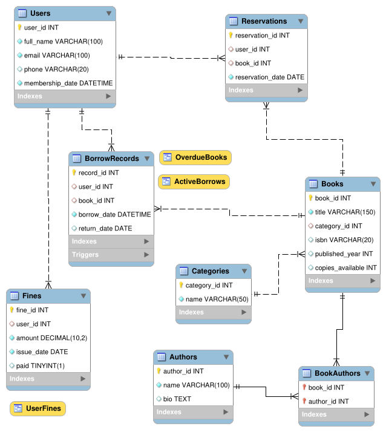

# Library Management Database

## Description

The **Library Management Database** is a comprehensive relational database designed to manage a library's operations.
The database has been built using MySQL.
Fnctionalities include tracking books, authors, library members, borrowing records, fines and reservations.
The tables have got constraints (primary keys, foreign keys, NOT NULL, UNIQUE), relationships (1-to-many and many-to-many), indexes for performance, triggers for automation, stored procedures for common operations, views for reporting and sample data for testing purposes.

### Key Features:

- **Tables**: Users, Authors, Categories, Books, BookAuthors (junction table), BorrowRecords, Fines, Reservations.
- **Relationships**: 1-to-many (Categories to Books) and many-to-many (Books to Authors via BookAuthors).
- **Constraints**: Ensures data integrity with primary keys, foreign keys and also cascading deletes.
- **Automation**: Triggers update book availability and assign fines for any overdue books.
- **Procedures**: Stored procedures for borrowing, returning and reserving books.
- **Reporting**: Views for active borrows, overdue books and user fines.
- **Sample Data**: Pre-populated data for testing.

## How to Run/Setup the Project

### Prerequisites

- **MySQL Server**: Version 5.6 or higher.
- **MySQL Workbench**: For executing the SQL script and visualizing the ER diagram.
- **Operating System**: Tested on Fedora (latest version), but compatible with any OS supporting MySQL.

### Setup Instructions

1. **Install MySQL and MySQL Workbench** (if not already installed):
   ```bash
   sudo dnf install mysql-server mysql-workbench
   sudo systemctl start mysqld
   sudo systemctl enable mysqld
   ```
2. **Log in to MySQL**:
   - Open a terminal or MySQL Workbench.
   - Log in with your MySQL user credentials:
     ```bash
     mysql -u your_username -p
     ```
3. **Create the Database**:

   - Copy the provided `library_management.sql` script.
   - In MySQL Workbench:
     - Open a new SQL Query tab.
     - Paste the script.
     - Execute (Ctrl+Shift+Enter).

4. **Verify Setup**:
   - Check that all tables are created:
     ```sql
     USE library_management;
     SHOW TABLES;
     ```
     Expected output: `Authors`, `BookAuthors`, `Books`, `BorrowRecords`, `Categories`, `Fines`, `Reservations`, `Users`.
   - Test views and procedures:
     ```sql
     SELECT * FROM ActiveBorrows;
     CALL BorrowBook(1, 1);
     ```
5. **Generate ER Diagram**:
   - In MySQL Workbench:
     - Go to **Database** > **Reverse Engineer...**.
     - Select the `library_management` database and all tables.
     - Follow the wizard to generate the ER diagram.
     - Export as PNG: **File** > **Export** > **Export as PNG**.

## ER Diagram

The Entity-Relationship Diagram visualizes the database schema, showing tables, columns, and relationships (1-to-many and many-to-many).


